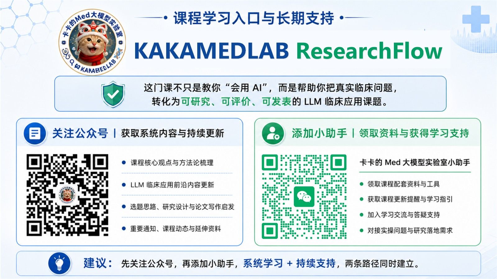
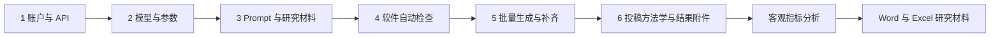

# KAKAMEDLAB ResearchFlow

**Clinical LLM Research Workflow**

把临床大语言模型研究，从零散调用推进到标准化实验、过程留痕与投稿材料生成。

  
  
  
  
  

[核心价值](#为什么需要-researchflow) · [双核心引擎](#双核心引擎) · [研究流程](#一条完整的研究流程) · [投稿产物](#核心产物不是一次回答) · [引用方式](#引用与致谢)

## 从一次模型调用，到一套可以说明的研究过程

单次 API 请求并不困难。真正困难的是：当研究涉及几十或上百份材料、多个模型、固定 Prompt、统一参数、失败补齐、Token 与费用记录、重复生成和论文报告时，如何保证每一次运行都处在同一套可说明、可检查的流程中。

**KAKAMEDLAB ResearchFlow** 是面向临床大语言模型研究的专有可视化工作流软件。它将原本需要工程代码完成的模型配置、批量处理、过程留痕和投稿材料整理，收进一条面向临床研究者的操作路径。

> ResearchFlow 不是“自动写论文工具”，也不是模型推荐器。它是一套帮助研究者固定实验条件、减少重复劳动、保留运行证据并形成论文材料底稿的研究基础设施。

## 为什么需要 ResearchFlow

| 研究方式 | 手动网页复制粘贴 | 自行编写 API 工程 | KAKAMEDLAB ResearchFlow |
|---|---|---|---|
| 批量处理研究材料 | 逐份操作，工作量随样本增长 | 可以实现，但需自行开发 | 可视化批量运行 |
| 多模型同条件比较 | 容易混淆模型与结果 | 需要维护模型路由和目录 | 同一任务配置多个模型 |
| 参数一致性 | 依赖人工记忆 | 需要自行固定并记录 | 参数确认后统一运行 |
| 失败与中断 | 通常依赖手动重做 | 需要编写检查点与恢复逻辑 | 自动检查、失败补齐与中断恢复 |
| 运行证据 | 需手工整理 | 需要另写日志系统 | 自动记录模型、参数、Token、费用与时间 |
| 投稿材料 | 运行结束后再次人工汇总 | 需要另写报告生成代码 | 自动形成方法学与补充材料底稿 |
| 使用门槛 | 操作简单，但难以规模化 | 工程门槛高 | 面向临床研究者的无代码流程 |

## 双核心引擎

### 01 · 标准化批量生成

围绕“同一研究条件下如何稳定获得一批结果”设计：

- 一个或多个模型进入同一实验清单
- 固定 Prompt、研究材料契约和生成参数
- 支持文本、图片及图文联合输入，统一生成文本结果
- 支持同一条件下的重复生成
- 自动检查真实材料、真实 Prompt、模型可用性和记录完整性
- 处理运行中断、短时调用失败和未完成项目
- 按任务时间与模型组织输出，避免人工混放

### 02 · 客观指标分析

围绕“生成结果如何进入下一步客观评价”设计：

- 读取 ResearchFlow 已完成任务，避免再次整理和上传结果
- 计算基础文本描述、中文文本特征和结构指标
- 可选统一翻译后计算常用英文可读性公式
- 读取 API 端到端耗时并计算文本输出效率
- 由研究者选择指标，软件同步生成方法学说明与结果文件
- Word 与 Excel 分工承载论文文字底稿和结构化指标数据

[查看完整产品能力](docs/PRODUCT_CAPABILITIES.md)

## 一条完整的研究流程

这是一条**用户可见的研究流程**，不是内部技术架构。研究者仍然负责研究问题、纳排标准、样本来源、Prompt 合理性、评价设计、统计方案和临床解释。

## 研究级能力矩阵

| 能力域 | ResearchFlow 提供的用户可见能力 |
|---|---|
| 实验配置 | 模型清单、生成参数、重复次数、任务模式统一确认 |
| 多模型运行 | 相同 Prompt、材料和参数条件下运行多个模型 |
| 多模态输入 | 文字到文字、图片到文字、图文联合到文字 |
| 运行控制 | 自动检查、进度反馈、停止任务、全新任务、中断恢复、未完成项目补齐 |
| 研究留痕 | 模型标识、返回状态、Prompt 指纹、材料指纹、响应标识、Token、费用与时间 |
| 输出管理 | 时间戳任务目录、模型独立目录、结果文件与技术记录分离 |
| 投稿报告 | 正文方法学简写、补充方法学、Prompt 文档、运行记录和结果附件 |
| 客观评价 | 中文描述指标、文本结构、可选英文可读性、端到端效率与结构化数据表 |

## 核心产物不是一次回答

ResearchFlow 的价值不止于保存模型输出，而在于把研究运行转换为可供团队复核和论文写作使用的材料体系。

### 批量生成模块

1. **正文 Methods 简写**：保留论文正文真正需要的模型、Prompt、参数与运行方式。
2. **补充方法学文件**：展开模型配置、输入契约、Prompt 信息、参数和运行规则。
3. **结果与运行附件**：记录任务结果、模型返回、Token、费用、时间与必要的状态信息。
4. **Prompt 记录**：保存研究者确认的 Prompt 原文、角色、版本和内容指纹。

### 客观指标分析模块

1. **正文 Methods 简写**：说明所选指标、语言路径和计算范围。
2. **补充方法学文件**：列出指标定义、计算逻辑、适用语言和参考依据。
3. **客观指标结果文件**：使用 Word 呈现结果说明，使用 Excel 保存逐份结构化数据。

[了解研究报告体系](docs/RESEARCH_REPORTING.md)

## 为临床 LLM 研究而设计

- **不替研究者选择模型**：软件提供标准化实验环境，不替代研究者的模型选择依据。
- **不替专家完成主观评价**：专家评分、临床正确性和内容安全性仍由研究方案决定。
- **不替代统计分析**：不同研究设计需要匹配相应统计方法，ResearchFlow 不擅自代替。
- **不掩盖研究条件**：软件帮助记录真实模型、参数、Prompt 和运行情况。
- **不将 API Key 写入研究输出**：密钥不进入结果文件或投稿附件。
- **要求研究材料完成脱敏**：研究者必须确认数据治理、伦理与知情同意要求。

[查看安全、隐私与研究治理边界](docs/SECURITY_AND_GOVERNANCE.md)

## 当前版本

| 项目 | 信息 |
|---|---|
| Product | KAKAMEDLAB ResearchFlow |
| Version | 3.0.0 |
| Build | 20260807.1 |
| Platform | Windows |
| Distribution | Proprietary commercial software |
| Repository | Product information and citation repository |

版本变化见 [CHANGELOG.md](CHANGELOG.md)。本仓库不分发源代码、安装包、激活组件、支付系统、凭据或内部基础设施。

## 引用与致谢

如果 ResearchFlow 对研究的 API 执行、运行留痕、投稿材料或客观指标处理构成实质支持，可在论文中使用以下致谢：

> API-based LLM execution, run logging, and objective-metrics processing were supported by KAKAMEDLAB ResearchFlow (version 3.0.0, Build 20260807.1; KAKAMEDLAB, China). Software information is available at: https://github.com/kkx9578/KAKAMEDLAB-ResearchFlow.

GitHub 可读取 [CITATION.cff](CITATION.cff) 显示标准引用信息。具体署名与致谢方式应结合目标期刊政策和软件对研究的实际贡献确定。

## 获取与长期支持

ResearchFlow 是 **卡卡的Med大模型实验室（KAKAMEDLAB）临床大语言模型应用 SCI 课程**的配套研究工具，面向临床医学生、研究生和医生。

- 课程系统讲解临床应用场景、Prompt 设计、API 运行、研究评价与论文报告
- 软件负责承接需要工程实现的批量调用、运行记录和材料整理
- 通过微信公众号与课程支持渠道获取授权、资料、更新和学习支持

微信公众号：**卡卡的Med大模型实验室（KAKAMEDLAB）**

## English Executive Summary

**KAKAMEDLAB ResearchFlow** is a proprietary visual workflow application for clinical large-language-model research. It supports standardized model configuration, batch and repeated API execution, text and image inputs, run provenance, publication-oriented research artifacts, and objective text metrics.

The application is designed to reduce the engineering burden between a research protocol and a documented API experiment. It does not replace protocol design, ethics review, de-identification, clinical expert evaluation, statistical analysis, or professional medical judgment.

This public repository provides product identity, capability descriptions, release information, acknowledgement guidance, and contact information only. See [PROPRIETARY_NOTICE.md](PROPRIETARY_NOTICE.md) for ownership and use restrictions.

---

**KAKAMEDLAB ResearchFlow · Clinical LLM Research Workflow**

Copyright © 2026 KAKAMEDLAB. All rights reserved.

