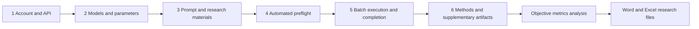

# KAKAMEDLAB ResearchFlow

**A Visual Research Workflow for Clinical LLM Studies**

From model configuration and standardized batch execution to traceable research records and publication-oriented artifacts.

  
  
  
  
  

[简体中文](README.md) · [English](README_EN.md)

[Why ResearchFlow](#why-researchflow) · [Core Engines](#two-core-engines) · [Workflow](#a-visible-research-workflow) · [Research Artifacts](#research-ready-artifacts) · [Citation](#citation-and-acknowledgement)

## From an API call to a documented research process

A single LLM API request is straightforward. A clinical research workflow is not. Once a study involves dozens or hundreds of materials, multiple models, a fixed prompt, controlled parameters, repeated generations, interrupted runs, token and cost records, and manuscript reporting, the real challenge becomes consistency and traceability.

**KAKAMEDLAB ResearchFlow** is a proprietary visual workflow application designed for clinical large-language-model research. It brings model configuration, standardized batch execution, run provenance, recovery controls, and publication-oriented documentation into one researcher-facing process.

> ResearchFlow is not an automated manuscript writer or a model recommendation service. It is research infrastructure for executing a predefined protocol consistently, preserving operational evidence, and preparing structured materials for scientific reporting.

## Why ResearchFlow

| Research task | Manual web workflow | Custom API engineering | ResearchFlow |
|---|---|---|---|
| Process many research materials | Repetitive and difficult to scale | Requires custom ingestion code | Visual batch execution |
| Compare multiple models | Results are easily mixed | Requires routing and directory logic | Multiple models under the same task configuration |
| Keep parameters consistent | Depends on manual discipline | Requires explicit implementation | Confirmed parameters applied across the run |
| Handle interruptions and incomplete items | Usually repeated manually | Requires checkpoints and recovery logic | Automated preflight, recovery, and completion checks |
| Preserve run provenance | Collected manually | Requires a separate logging layer | Model, prompt, token, cost, timing, and status records |
| Prepare manuscript support files | Reconstructed after the experiment | Requires report-generation code | Publication-oriented method and supplementary drafts |

## Two core engines

### 01. Standardized batch generation

- Configure one or more models within the same experiment.
- Fix the prompt, research-material contract, and generation parameters.
- Support text-to-text, image-to-text, and combined image-and-text inputs.
- Run repeated generations under the same declared conditions.
- Perform a real-material preflight before the full task.
- Track progress and address interruptions or incomplete items.
- Separate model outputs from technical records in an organized task directory.

### 02. Objective metrics analysis

- Read completed ResearchFlow tasks without asking researchers to reorganize outputs.
- Calculate descriptive text measures and Chinese-language structural features.
- Optionally translate results through one fixed model before applying common English readability formulas.
- Use API endpoint timing records to calculate text-generation efficiency.
- Generate manuscript-oriented methods text together with Word and Excel result files.
- Preserve metric definitions, language pathways, and reference information for review.

## A visible research workflow

This diagram represents the user-visible workflow, not the internal software architecture. Researchers remain responsible for the research question, eligibility criteria, source data, prompt validity, evaluation design, statistical analysis, and clinical interpretation.

## Research-ready artifacts

ResearchFlow is designed to produce more than isolated model responses.

### Batch-generation module

1. **Concise manuscript Methods draft** covering the essential model, prompt, parameter, and execution information.
2. **Detailed supplementary methods** describing the experimental configuration and run rules.
3. **Run and result appendix** containing structured operational evidence and task-level outcomes.
4. **Prompt record** preserving the confirmed prompt text, role, version, and content fingerprint.

### Objective-metrics module

1. **Concise manuscript Methods draft** describing selected metrics and the language-analysis pathway.
2. **Detailed supplementary methods** documenting metric definitions, calculation rules, applicable language, and references.
3. **Objective-metrics results** presented as a readable Word report and a structured Excel dataset.

These artifacts are research-writing aids and documentation drafts. They do not guarantee compliance with a specific journal and must be reviewed against the final protocol, data, and target-journal requirements.

## Research and governance boundaries

- ResearchFlow does not select models on behalf of the investigator.
- It does not replace expert evaluation, clinical validation, or professional medical judgement.
- It does not prescribe a statistical analysis plan for heterogeneous study designs.
- API keys are not written into research outputs or manuscript appendices.
- Investigators must de-identify materials and satisfy applicable ethics, consent, privacy, and data-governance requirements.
- Model availability, provider behavior, and hosted-model reproducibility remain external constraints.

See [Security, Privacy, and Research Governance](docs/SECURITY_AND_GOVERNANCE.md) for the current public boundary statement.

## Version and distribution

| Item | Current information |
|---|---|
| Product | KAKAMEDLAB ResearchFlow |
| Version | 3.0.0 |
| Build | 20260807.1 |
| Platform | Windows |
| Distribution | Proprietary commercial software |
| Repository scope | Product information, release notes, and citation guidance |

This repository does **not** distribute source code, installers, activation components, credentials, payment configuration, or private infrastructure. See [PROPRIETARY_NOTICE.md](PROPRIETARY_NOTICE.md) for ownership and use restrictions.

## Citation and acknowledgement

When ResearchFlow materially supports API execution, run provenance, publication documentation, or objective-metrics processing, the following acknowledgement may be adapted to the target journal:

> API-based LLM execution, run logging, and objective-metrics processing were supported by KAKAMEDLAB ResearchFlow (version 3.0.0, Build 20260807.1; KAKAMEDLAB, China). Software information is available at: https://github.com/kkx9578/KAKAMEDLAB-ResearchFlow.

GitHub can also read [CITATION.cff](CITATION.cff) to display structured citation information. Authorship, citation, and acknowledgement decisions should follow the target journal's policy and the software's actual contribution to the study.

## Access and support

ResearchFlow accompanies the KAKAMEDLAB clinical LLM research curriculum for medical students, postgraduate researchers, and clinicians. Access, licensing, learning materials, updates, and support are provided through official KAKAMEDLAB course and communication channels.

Official WeChat account: **卡卡的Med大模型实验室 (KAKAMEDLAB)**

---

**KAKAMEDLAB ResearchFlow · Clinical LLM Research Workflow**

Copyright © 2026 KAKAMEDLAB. All rights reserved.

